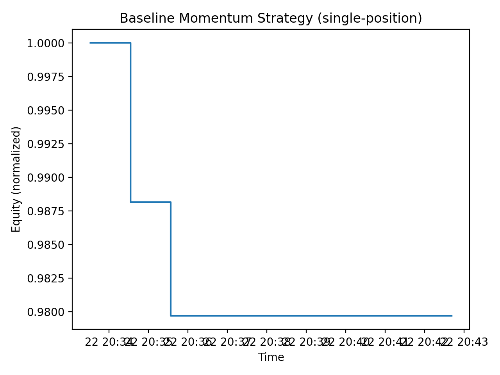
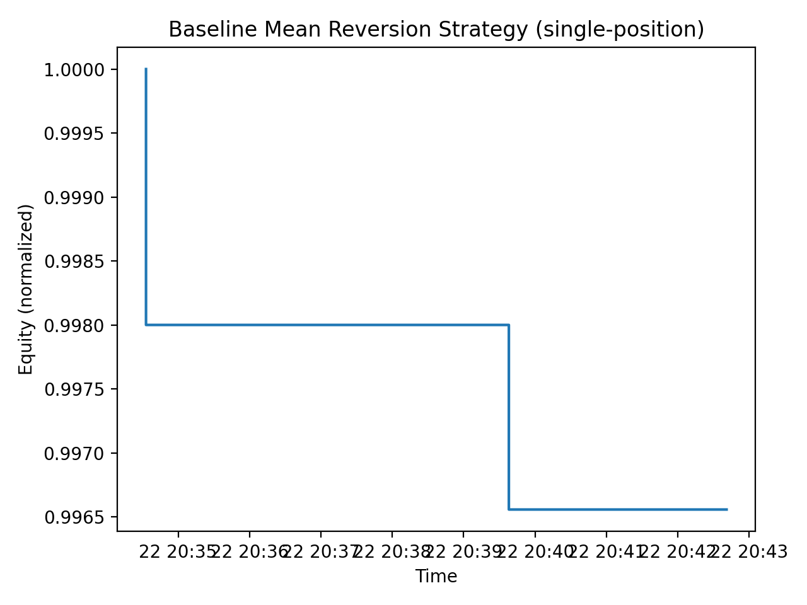
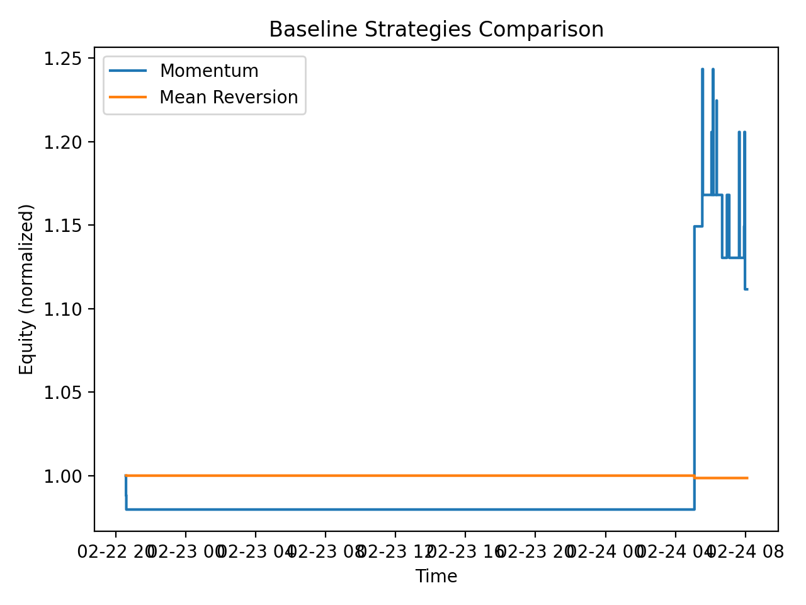

# GE Trade - RL + LLM Signals Project

In this project I'm exploring the ability to train a reinforcement learning agent to trade a simplified Grand Exchange-style market using public price data.
This also explore the ability to integrate with LLM-derived "sentiment / event" features, based on community discussions, path notes, and other possible extra signals.

## Goals
- Build a reproducible market simulator (prices, transaction costs, inventory, cash)
- Implement baselines (momentum, mean-reversion)
- Train the RL agent, either PPO or DQN, and compare their performance.
- Add LLM derived sentiment features and run ablation tests

## Repo Structure
- `/scripts` will contain all of the runnable entry points (pull data, backtest, train, eval)
- `src/ingest/` will contain the data fetching + caching
- `src/features/` will contain feature engineering
- `src/env/` will contain the Gymnasium environment
- `src/rl` will contain the training 
- `src/eval` will contain metrics + plots
- `docs/` will contain design and the devlogs

## Market snapshot exploration
Initial analysis of a GE price snapshot shows a strong inverse relationship
between item price and relative bid–ask spread, highlighting liquidity risk
in low-priced items. This motivates explicit transaction-cost modeling
in the RL environment.

## Snapshot plots (example)
Top Spread% bar chart gives a quick "Market Microstructure / Liquidity risk exists" artifact.
Analysis:
- Largest spreads are 45-50%, even after filtering
- High spread % means that **buying and immediately selling is expensive**.
My understanding:
- Most likely these items have low trade volume, a sporadic demand, stale low prics (such as someone selling at 1 gp), or asymmetric demand between buyers/sellers. 
- The GE prices are actually reflecting *executed* trades, not a live order book, which is why spreads are noisy for illiquid items.
Overall:
- High spread is not equal to good profit. So very *high execution risk*

Spread% vs mid (log x-axis) shows the relationship between price level and spread
Analysis:
- Clear inverse relationship between low price items having wide spread % and high price items having tight spread %
- Dense cluster around 0% at high mid prices
- Longish tail of noisy, illiquid items in low prices
My understanding:
- High value items are traded frequently, there is competitive pricing, and lots of buyers/sellers, so this leads to tight spreads
- Cheap items have a thin volum, there might be price anchoring issues, and stale low/high, which leads to artificial spread inflation
Overall: 
- Liquidity scaled with price and popularity, which might imply that LLM sentiment might provide better results.

## Baseline strategies

