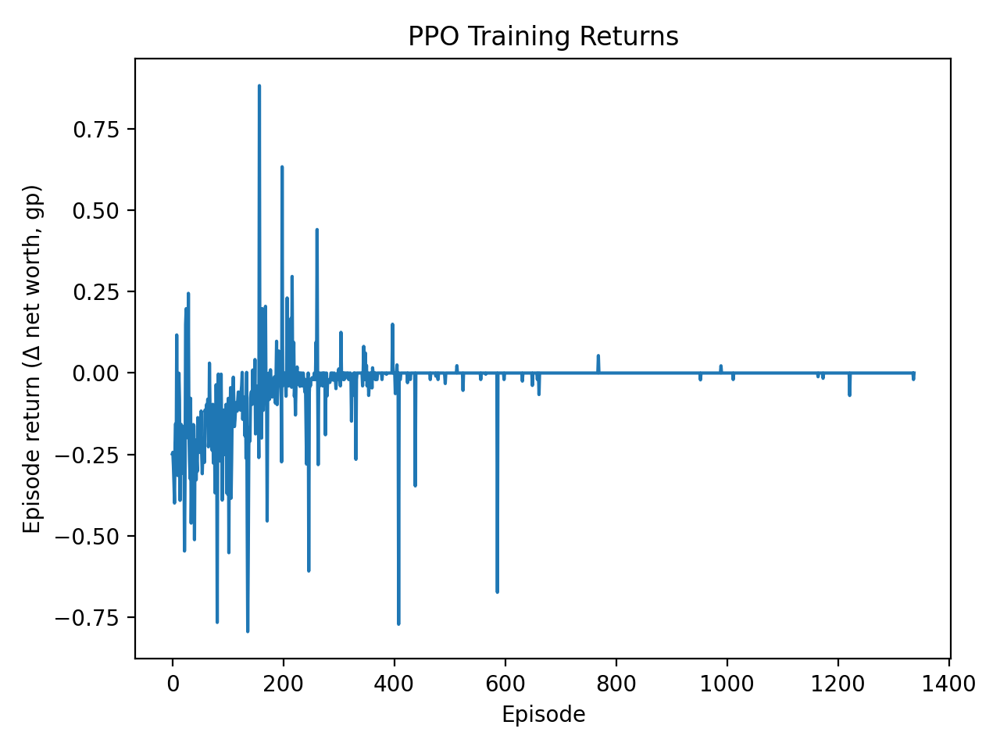
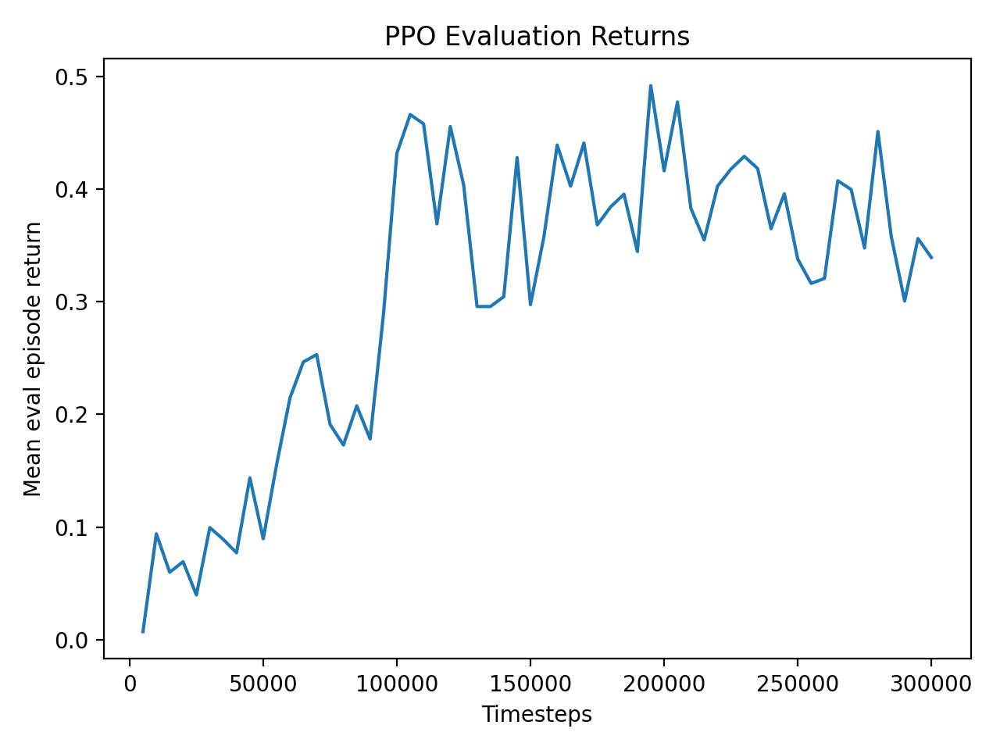
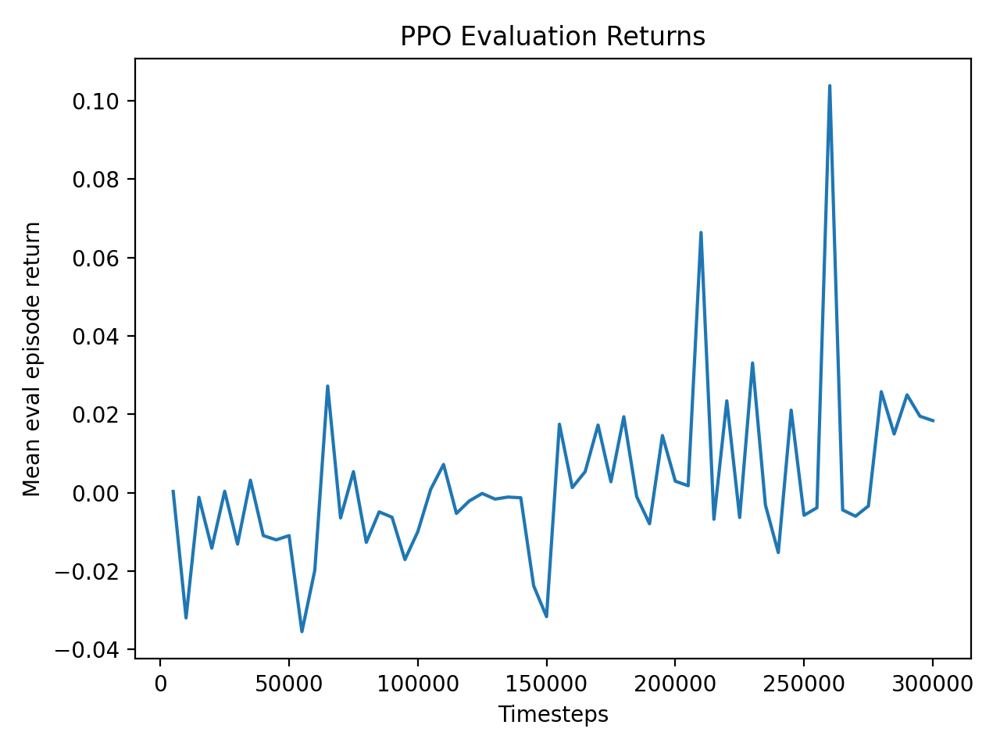

# GE Trade - RL + LLM Signals Project

In this project I'm exploring the ability to train a reinforcement learning agent to trade a simplified Grand Exchange-style market using public price data.
This also explore the ability to integrate with LLM-derived "sentiment / event" features, based on community discussions, path notes, and other possible extra signals.

## Goals
- Build a reproducible market simulator (prices, transaction costs, inventory, cash)
- Implement baselines (momentum, mean-reversion)
- Train the RL agent, either PPO or DQN, and compare their performance.
- Add LLM derived sentiment features and run ablation tests

## Repo Structure
- `/scripts` will contain all of the runnable entry points (pull data, backtest, train, eval)
- `src/ingest/` will contain the data fetching + caching
- `src/features/` will contain feature engineering
- `src/env/` will contain the Gymnasium environment
- `src/rl` will contain the training 
- `src/eval` will contain metrics + plots
- `docs/` will contain design and the devlogs

## Market snapshot exploration
Initial analysis of a GE price snapshot shows a strong inverse relationship
between item price and relative bid–ask spread, highlighting liquidity risk
in low-priced items. This motivates explicit transaction-cost modeling
in the RL environment.

## Snapshot plots (example)
Top Spread% bar chart gives a quick "Market Microstructure / Liquidity risk exists" artifact.
Analysis:
- Largest spreads are 45-50%, even after filtering
- High spread % means that **buying and immediately selling is expensive**.
My understanding:
- Most likely these items have low trade volume, a sporadic demand, stale low prics (such as someone selling at 1 gp), or asymmetric demand between buyers/sellers. 
- The GE prices are actually reflecting *executed* trades, not a live order book, which is why spreads are noisy for illiquid items.
Overall:
- High spread is not equal to good profit. So very *high execution risk*

Spread% vs mid (log x-axis) shows the relationship between price level and spread
Analysis:
- Clear inverse relationship between low price items having wide spread % and high price items having tight spread %
- Dense cluster around 0% at high mid prices
- Longish tail of noisy, illiquid items in low prices
My understanding:
- High value items are traded frequently, there is competitive pricing, and lots of buyers/sellers, so this leads to tight spreads
- Cheap items have a thin volum, there might be price anchoring issues, and stale low/high, which leads to artificial spread inflation
Overall: 
- Liquidity scaled with price and popularity, which might imply that LLM sentiment might provide better results.

## Baseline strategies

## First PPO Results on 3 hours of GE data 

**Configuration**
- Episode length: 75
- Starting cash: 10,000,000 GP
- Observation: top-K GE snapshot (filtered by spread/volatility)
- Reward: per-step log change in net worth
- Data: ~3 hours of GE snapshots

**Observed behavior**
- Episode return quickly converged to ~0 and flat-lined
- PPO frequently chose HOLD or traded very rarely
- Explained variance was often near zero, indicating the value function could not model returns

**Root cause (post-hoc analysis)**
This was not an RL instability or lack of signal.

The environment had a **valuation bug**:
- Net worth was computed only from the filtered top-K snapshot
- If a held item disappeared from the observation slice, its value dropped to zero
- End-of-episode liquidation could use incomplete pricing data

These artifacts produced high-variance, misleading rewards that prevented PPO from learning a stable value function.

**Conclusion**
- The agent learned to avoid trading, not because trading was unprofitable, but because rewards were corrupted.
- PPO performance in this phase is not meaningful.

---

## Environment Fixes

The GE environment was audited and corrected before retraining:

- Added a full-universe snapshot for mark-to-market valuation and liquidation
- Ensured held positions are always valued, even when not in the observation slice
- Corrected end-of-episode valuation timing
- Added carry-forward pricing (`last_pos_price`) to handle sparse snapshots

After these fixes:
- Net worth is stable and monotonic
- No artificial zero-equity events occur
- Reward reflects true trading performance

---

### Second PPO Results (Post-Fix)

**Training diagnostics**
- Mean evaluation reward increases steadily and plateaus cleanly
- KL divergence and entropy remain within healthy ranges
- Explained variance improves significantly, indicating a learnable value function

---

### v2 Baseline (Resting Orders, Partial Fills, Sell Sanity)

**Environment (v2 / v2.1)**
- Resting buy/sell offers with probabilistic partial fills; discrete price offsets; single active buy + single active sell; CANCEL_BUY / CANCEL_SELL. No instant mid execution.
- Valuation: single source of truth from full slice; acted_mid matches acted_item_id; off-by-one fixed.

**Sell behavior (before vs after blocked-sell penalties)**
| Metric | Before penalties | After penalties |
|--------|-------------------|------------------|
| requested SELL | 785 | 697 |
| executed SELL (fills) | 203 | 181 |
| rejected (blocked) | 510 | **91** |
| sell_blocked_active_order | dominant | 88 |
| sell_blocked_no_position | — | 3 |

- Blocked sells collapsed from ~65% to ~13% of requested SELL. Policy stopped spamming SELL when a sell was already resting; reward shaping (small penalties for sell_blocked_active_order and sell_blocked_no_position) worked.

**Valuation**
- Valuation (pos_mid vs acted_mid for same item): OK. Large reprices (e.g. 8k → 73k) are data-driven MTM/regime change, not bugs. Debug logic no longer falsely panics; valuation path is a single source of truth.

**Equity profile (50 episodes)**
- Final equity mean **1.019**, std **0.093**, min/max **0.86 / 1.33**.
- Realistic flipping agent: some bad runs, some big wins, mean slightly positive, no guaranteed arbitrage. Tighter variance and inflated mean would suggest instant execution; this profile matches v2 microstructure.

This is locked as a good v2 baseline (potentially v2.2) and a solid position for further training and robustness (seeds, OOS eval, fill logic on full slice).

---

### Out-of-Sample Evaluation

The trained policy was evaluated on a **held-out time range** not used during training.

| Policy                | Final Equity (Mean) |
|-----------------------|---------------------|
| **PPO (trained)**     | **1.57×** |
| Always HOLD           | 1.00× |
| Random valid actions  | 0.91× |
| Momentum heuristic    | 0.96× |

Additional observations:
- Trades per episode: ~9–10
- Inventory exposure: <10% of episode steps
- Trades are sparse and intentional, not churn
- No valuation artifacts or invalid liquidations observed

---

### Conclusion

The failure of the initial PPO run was caused by **environment-level valuation errors**, not by reinforcement learning instability or lack of predictive signal.

Once corrected:
- PPO successfully learns a profitable trading policy
- Performance generalizes out-of-sample
- The environment provides a reliable foundation for further realism improvements

The current simulator uses instant mid-price execution and simplified mechanics. Future work will focus on modeling true OSRS GE behavior, including:
- Rolling 4-hour buy limits
- Offer slots
- Limit-order placement and partial fills
- More realistic fill dynamics

This establishes a clean v1 baseline before introducing additional market complexity.