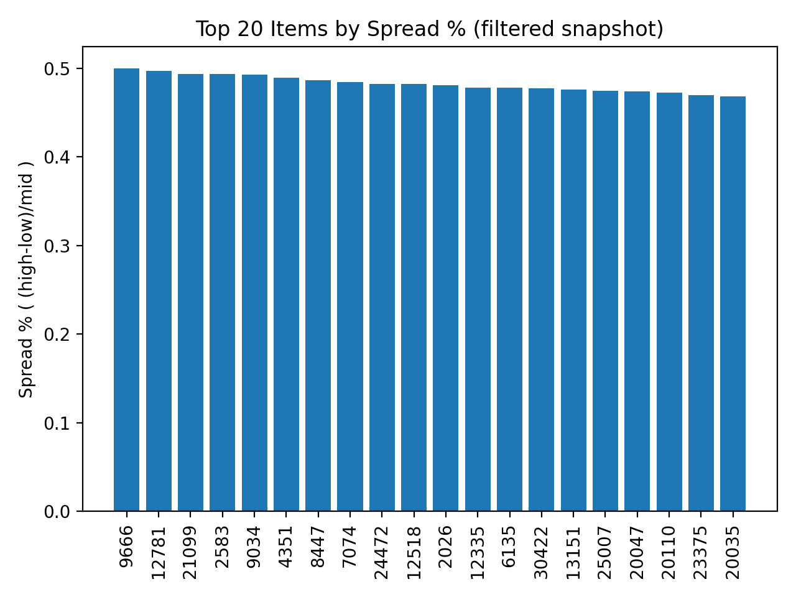
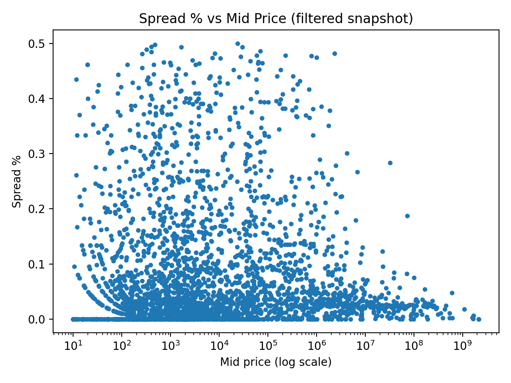

# GE Trade - RL + LLM Signals Project

In this project I'm exploring the ability to train a reinforcement learning agent to trade a simplified Grand Exchange-style market using public price data.
This also explore the ability to integrate with LLM-derived "sentiment / event" features, based on community discussions, path notes, and other possible extra signals.

## Goals
- Build a reproducible market simulator (prices, transaction costs, inventory, cash)
- Implement baselines (momentum, mean-reversion)
- Train the RL agent, either PPO or DQN, and compare their performance.
- Add LLM derived sentiment features and run ablation tests

## Repo Structure
- `/scripts` will contain all of the runnable entry points (pull data, backtest, train, eval)
- `src/ingest/` will contain the data fetching + caching
- `src/features/` will contain feature engineering
- `src/env/` will contain the Gymnasium environment
- `src/rl` will contain the training 
- `src/eval` will contain metrics + plots
- `docs/` will contain design and the devlogs

## Snapshot plots (example)
Top Spread% bar chart gives a quick "Market Microstructure / Liquidity risk exists" artifact.

Spread% vs mid (log x-axis) shows the relationship between price level and spread
